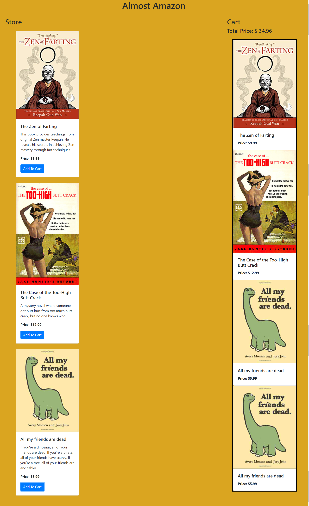

# Almost-Amazon

This project was an exercise to create a website where you can add products to your cart. I practiced using ES6 modules and using get and set methods for functions.

## How to run this project
* Use npm to install http-server in your terminal:
```sh
npm install -g http-server
```
* Run the server
```sh
hs -p 9999
```
* Open chrome and navigate to:
```
localhost:9999
```

## Screenshots

### Homepage
